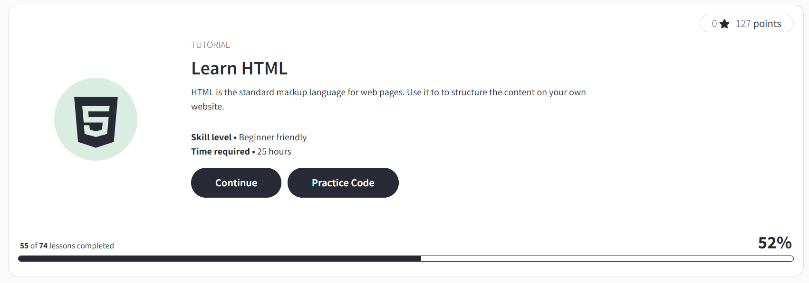

# Emilia Gareeva 
Junior FrontEnd Developer

## Contact Information:

**Phone:** *8-996-107-15-32*

**E-mail:** *emilynovael@icloud.com*

**Telegram:** *@shmupella*

**Discord:** *Shmupella(@ Shmupella)*

**GitHub:** [Shmupella](https://github.com/Shmupella)

## About myself

 I am 27 years old. Now I work in mobile operator company and study programming in [Sber 21 School](https://21-school.ru/). I like to learn something new and coding :)

It is fantastic feeling - when you finally get what you want. When you trying to understand essencу and in one moment your results improve.

## Skils

* C, C++ (basic)
* HTML, CSS (basic)
* Java Script (learning)
* VS Code, WebStorm
* Linux, Bash, Shell
* Docker
* SQL, Postgresql
* QT Creator
* Unit testing (GTest, Check)
* Git, GitHub/GitLab, CI/CD

## Code Examples
```
int min(int* array, int arrayLength) {
    int i = 1;
    int min = array[0];
    for (; i < arrayLength; i ++) {
        if (array[i] < min) {
            min = array[i];
        }
    }
    return min;
}

int max(int* array, int arrayLength) {
    int i = 1;
    int max = array[0];
    for (; i < arrayLength; i ++) {
        if (array[i] > max) {
            max = array[i];
        }
    }
    return max;
}
```

## Work Experience
You can see the projects I have done in 21 School on my GitHub.

## Education

* Sber 21 School student
* HTML course in [W3School](https://www.w3schools.com/)



## English language
My level of English is A2. 